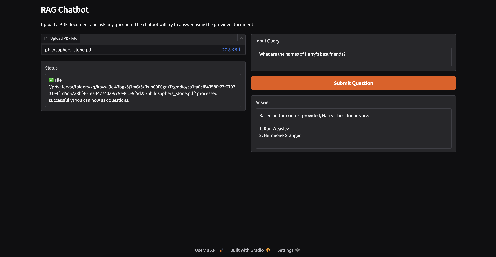

# qa-bot-with-rag

A simple question–answer bot built with RAG (Retrieval-Augmented Generation) using LangChain and free local models. Upload a PDF document and ask questions about its content.

## 🎓 Inspiration

This repository is inspired by the final project of the Coursera course [**Generative AI Engineering with LLMs Specialization**](https://www.coursera.org/specializations/generative-ai-engineering-with-llms). The implementation has been enhanced with free local models and improved functionality.

## 📷 Screenshots



*Web application interface showing PDF upload, question input, and AI-generated answers*

## Features

- PDF document processing and text extraction
- Vector-based document retrieval using ChromaDB
- Question answering using Ollama (free local LLM)
- User-friendly Gradio web interface

## Installation

### 1. Install Python Dependencies
```bash
pip install -e .
```

### 2. Install Ollama (Local LLM)

Visit [https://ollama.com/](https://ollama.com/) and follow the installation instructions for your platform (macOS, Linux, or Windows).

### 3. Start Ollama Service

After installation, start the Ollama service (refer to [https://ollama.com/](https://ollama.com/) for platform-specific instructions).

```bash
# Typically:
ollama serve
```

### 4. Download a Language Model
```bash
# Download Llama2 (recommended, ~3.8GB)
ollama pull llama2

# Or try other models:
# ollama pull mistral    # Alternative model
# ollama pull codellama  # For code-related tasks
```

### 5. Verify Installation
```bash
# Check available models
ollama list

# Test the model
ollama run llama2 "Hello, how are you?"
```

## Usage

### Option 1: Gradio Web Interface
```bash
python qabot.py
```
Then open your browser and go to `http://localhost:7860`

### Option 2: Jupyter Notebook Testing
```bash
jupyter notebook test_rag_notebook.ipynb
```

## How It Works

1. **Upload a PDF file** using the file uploader
2. **Type your question** in the text box
3. **Get answers** based on the document content using:
   - **Ollama** (llama2) for question answering
   - **HuggingFace embeddings** for document retrieval
   - **ChromaDB** for vector storage

## Project Structure

- `qabot.py` - Main Gradio web application
- `test_rag_notebook.ipynb` - Jupyter notebook for testing
- `rag_functions.py` - Shared RAG functions module
- `pyproject.toml` - Project dependencies
- `README.md` - This file

## Dependencies

- `langchain` - Framework for building LLM applications
- `langchain-community` - Community integrations for LangChain
- `gradio` - Web UI framework
- `chromadb` - Vector database for embeddings
- `pypdf` - PDF processing library
- `sentence-transformers` - For HuggingFace embeddings
- `torch` - PyTorch for ML models

## Troubleshooting

### Ollama Issues
- **Installation**: Visit [https://ollama.com/](https://ollama.com/) for platform-specific setup
- **Service not running**: Check if Ollama is started (`ollama serve`)
- **Model not found**: Download required model (`ollama pull llama2`)
- **Port conflicts**: Ollama uses port 11434 by default

### Memory Issues
- Llama2 requires ~8GB RAM for optimal performance
- Use smaller models if needed: `ollama pull llama2:7b-chat-q4_0`

### Performance Tips
- Use SSD storage for better model loading times
- Close unnecessary applications to free up RAM
- Consider GPU acceleration if available